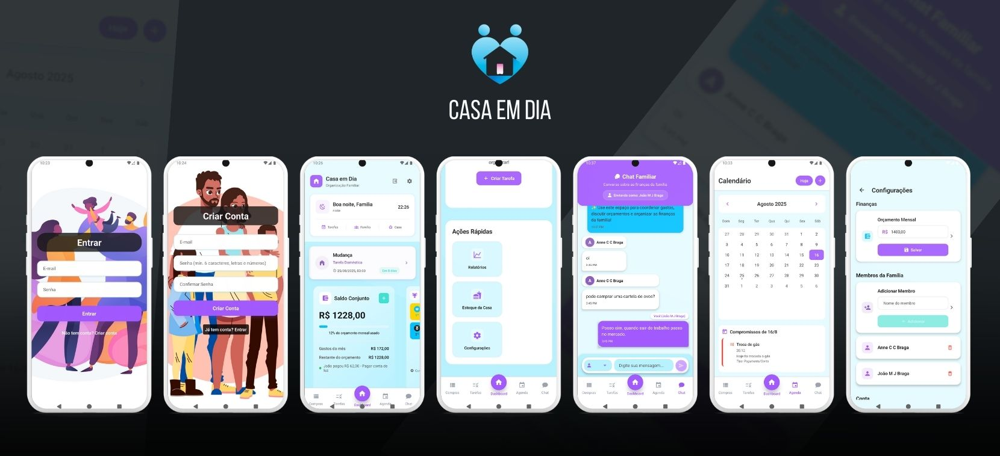

# Casa em Dia

Casa em Dia é um aplicativo mobile para organização doméstica, criado com React Native, Expo e Firebase. O projeto concentra tarefas, lista de compras, convites de família, gamificação e notificações em uma experiência colaborativa para o dia a dia.

## O que o app faz

- Login com Google via Firebase Auth
- Gestão de famílias compartilhadas com convites por e-mail
- Tarefas com responsáveis, pontos e ranking
- Lista de compras colaborativa com pontos por item marcado como comprado
- Notificações push via OneSignal
- Tema claro estilo iOS com visual minimalista
- Navegação e componentes reestilizados para maior clareza e consistência
- Cores unificadas e superfícies mais limpas
- Correções de bugs e inconsistências no tema e tipos
- Persistência offline nativa via Firestore

## Arquitetura atual

A base do projeto foi reorganizada para separar responsabilidades entre:

- Rotas e telas em src/app
- Contextos para autenticação, família, membros e convites em src/contexts
- Serviços com a lógica de domínio em src/services, como:
  - family.ts
  - tasks.ts
  - shopping.ts
  - family-members.ts
  - account.ts
- Helpers e integrações em src/lib, incluindo Firebase, gamificação, OneSignal e autenticação Google

Essa estrutura ajuda a manter as telas mais enxutas e centraliza as regras de negócio em pontos mais fáceis de manter.

## Requisitos

- Node.js 20+ (22 recomendado para CI)
- npm
- Android Studio e um emulador ou dispositivo Android
- Conta Firebase com Firestore e Google Sign-In habilitados
- Conta OneSignal para notificações push

## Configuração rápida

1. Clone o repositório
2. Copie o arquivo de exemplo de variáveis de ambiente:

```bash
cp .env.example .env
```

3. Preencha as variáveis no arquivo .env com as credenciais do Firebase e do OneSignal.

4. Instale as dependências:

```bash
npm install
```

5. Gere o projeto Android (se necessário):

```bash
npx expo prebuild --platform android
```

6. Execute o app:

```bash
npm run android
```

## Variáveis de ambiente

As variáveis esperadas são:

```env
EXPO_PUBLIC_FIREBASE_API_KEY=
EXPO_PUBLIC_FIREBASE_AUTH_DOMAIN=
EXPO_PUBLIC_FIREBASE_PROJECT_ID=
EXPO_PUBLIC_FIREBASE_STORAGE_BUCKET=
EXPO_PUBLIC_FIREBASE_MESSAGING_SENDER_ID=
EXPO_PUBLIC_FIREBASE_APP_ID=
EXPO_PUBLIC_GOOGLE_WEB_CLIENT_ID=
EXPO_PUBLIC_ONESIGNAL_APP_ID=
EXPO_PUBLIC_ONESIGNAL_REST_API_KEY=
```

O template completo está em [.env.example](./.env.example).

## Firebase e Firestore

O app usa Firebase Auth, Firestore e regras de segurança definidas em [firestore.rules](./firestore.rules).

Resumo do fluxo principal:

- O primeiro login cria a família do usuário, quando necessário
- O administrador pode convidar membros por e-mail
- O convite é aceito pelo destinatário e o membro entra na família
- As operações principais de tarefas, compras, convites e gamificação são persistidas no Firestore

## Notificações push

As notificações são enviadas para os membros da família via OneSignal, com filtragem por família e usuário. O fluxo cobre eventos como criação de tarefas, conclusão, reabertura, remoção e atualização de itens da lista de compras.

## Scripts

```bash
npm start
npm run android
npm run lint
npm run lint:fix
npm run format
npm run format:check
npm run typecheck
```

## Validação

Use o TypeScript para validar tipos sem output:

```bash
npm run typecheck
```

Verifique formatação e lint antes de commitar:

```bash
npm run format:check
npm run lint
```

Para aplicar correções automáticas:

```bash
npm run format
npm run lint:fix
```

## Integração contínua (CI)

O repositório roda um workflow GitHub Actions em `push` e `pull_request` para as branches `main` e `master`.

Ele realiza as seguintes etapas:

- instala dependências com `npm ci`
- executa `npm run format:check`
- executa `npm run lint`
- executa `npx tsc --noEmit`

Se qualquer etapa falhar, o resultado do `tsc` é armazenado como artefato de build.

## Estrutura do projeto

```text
casaemdia/
├── app.json
├── eas.json
├── firebase.json
├── firestore.rules
├── .env.example
└── src/
    ├── app/
    ├── components/
    ├── contexts/
    ├── hooks/
    ├── lib/
    ├── services/
    ├── types/
    └── assets/
```

## Solução de problemas

### Google Sign-In com erro DEVELOPER_ERROR

- Verifique se o SHA-1 do keystore de debug foi registrado no Firebase
- Confirme se o package name do app corresponde ao cadastrado
- Baixe novamente o google-services.json após ajustar a configuração

### Erro de API key no Firebase

- Verifique se as variáveis no arquivo .env estão corretas
- Reinicie o Metro/Expo após alterar o ambiente

## Contribuição

1. Faça um fork do projeto
2. Crie uma branch para a mudança
3. Envie o pull request com uma descrição clara

## Licença

MIT License
